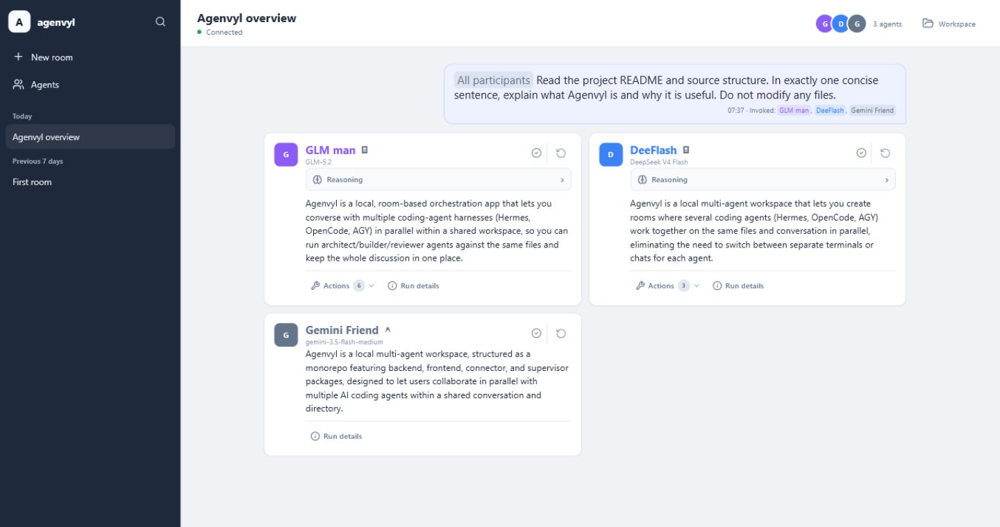
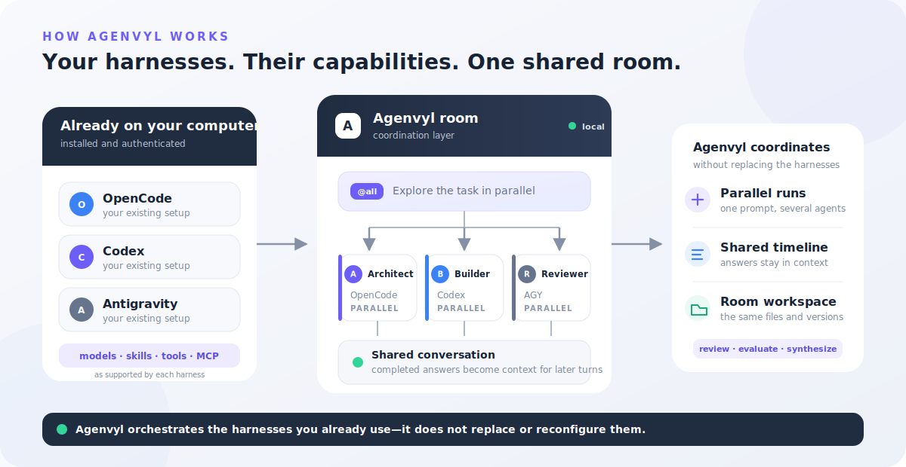

# Agenvyl

**One browser. Multiple coding agents. One shared workspace.**

Agenvyl is a local web interface that brings your already-installed coding
agents into shared rooms. Each tool keeps its own models, accounts, skills,
tools, and MCP integrations while Agenvyl coordinates the conversation,
parallel runs, and shared files.


[](LICENSE)

**[Install](#quick-start)** · [See how it works](#how-it-works) ·
[Connect an agent](docs/harnesses/README.md) ·
[Read the documentation](docs/README.md)



## Why Agenvyl?

Coding agents usually live in separate terminals and chats. Their context,
files, and decisions become fragmented.

Agenvyl gives them one browser-based room:

- **Shared context** — later agents can read, critique, and combine completed
  answers from earlier turns.
- **Parallel runs** — mention several agents once and let them explore the same
  task independently.
- **Shared files** — agents start from the same saved room files. Agenvyl keeps
  earlier versions and safely applies completed changes.
- **Your existing setup** — reuse each harness with its configured models,
  permissions, skills, tools, hooks, and MCP servers.

## How it works



1. Create a room for a project, review, experiment, or other task.
2. Add agents with different names, roles, models, and instructions.
3. Send one message to an agent, several agents, or `@all`.
4. Review their completed answers and ask another agent to synthesize the
   result.

Agents launched by the same message receive the same pre-round conversation and
the same starting files, and can run in parallel. They do not see one another's
unfinished output or file changes. Agenvyl applies completed file changes to the
room and asks you to resolve a conflict instead of silently overwriting newer
work. Completed selected answers become context for later turns.

A message without an `@mention` is saved in the room but starts no agent.

For components, persistence, retries, and security boundaries, read
[How Agenvyl works](docs/architecture/overview.md).

## Supported coding-agent harnesses

| Harness | Connection |
| --- | --- |
| [Codex CLI](docs/harnesses/codex.md) | Agenvyl starts the user-installed `codex app-server` |
| [Claude Code](docs/harnesses/claude.md) *(experimental)* | Agenvyl starts a fresh user-installed CLI process per attempt |
| [OpenCode](docs/harnesses/opencode.md) | Agenvyl connects to or manages an OpenCode server |
| [Antigravity / AGY](docs/harnesses/antigravity.md) | Agenvyl starts a fresh `agy --print` process per attempt |
| [Hermes](docs/harnesses/hermes.md) | Agenvyl connects to an authenticated local Hermes API Server |

Agenvyl does not provide model access. The harness must already be installed or
running and authenticated on the same computer. One harness can power several
Agenvyl agents with different names, models, permissions, and instructions.

## Quick start

The downloadable app includes Node.js and PostgreSQL. You do **not** need
Docker, npm, or a source checkout.

Supported packages are Windows 10/11 x64, Linux x64/arm64, and macOS on Intel or
Apple silicon.

> [!WARNING]
> Agenvyl is an unsigned Technical Preview for a trusted, single-user computer.
> Read [Trust and security](docs/user-guide/trust-and-security.md) before
> accepting a SmartScreen or Gatekeeper warning.

### Windows

Open PowerShell:

```powershell
irm https://github.com/riffi/agenvyl/releases/latest/download/install.ps1 | iex
```

### Linux and macOS

Open a terminal:

```bash
curl -fsSL https://github.com/riffi/agenvyl/releases/latest/download/install.sh | sh
```

The installer verifies the selected archive, initializes the local stack,
detects supported harnesses, and opens the guided setup. If the browser does not
open, visit <http://127.0.0.1:8791>.

For archive installation, data locations, backups, updates, and uninstall, use
the [User Guide](docs/user-guide/installation.md).

## Your first room

Ask every agent in the room for an independent proposal:

```text
@all Propose the best approach to this task from your perspective.
```

Then ask one agent to compare the completed results:

```text
@reviewer Read the answers above, evaluate their trade-offs, and synthesize the best plan.
```

Or guide a software workflow:

```text
@architect Read the project and propose a safe implementation plan.
@builder Implement the agreed plan and run the tests.
@architect @reviewer Check the change from different perspectives.
```

Rooms are useful beyond software: research, writing, document review, planning,
and model comparison all use the same shared-history pattern.

## Local-first boundary

- The Web UI, product state, room history, and workspaces run on your computer.
- Agenvyl adds no telemetry or remote analytics.
- Connected harnesses use your normal operating-system permissions.
- A room workspace is a shared working directory, **not a security sandbox**.
- Do not enable a harness or permission profile you would not trust with the
  selected files.
- Agenvyl has no public multi-user authorization layer.

## Documentation

Use the [documentation map](docs/README.md) to choose a route:

- [Install and use Agenvyl](docs/user-guide/installation.md)
- [Work with Workspace files and previews](docs/user-guide/workspace.md)
- [Connect an agent tool](docs/harnesses/README.md)
- [Understand the architecture](docs/architecture/overview.md)
- [Operate a custom deployment](docs/operations/deployment-boundaries.md)
- [Develop Agenvyl](docs/development/README.md)
- [Prepare a Technical Preview release](docs/releases/README.md)

Contribution policy is in [CONTRIBUTING.md](CONTRIBUTING.md), and private
vulnerability reporting is in [SECURITY.md](SECURITY.md).

Agenvyl is licensed under the [Apache License 2.0](LICENSE).
