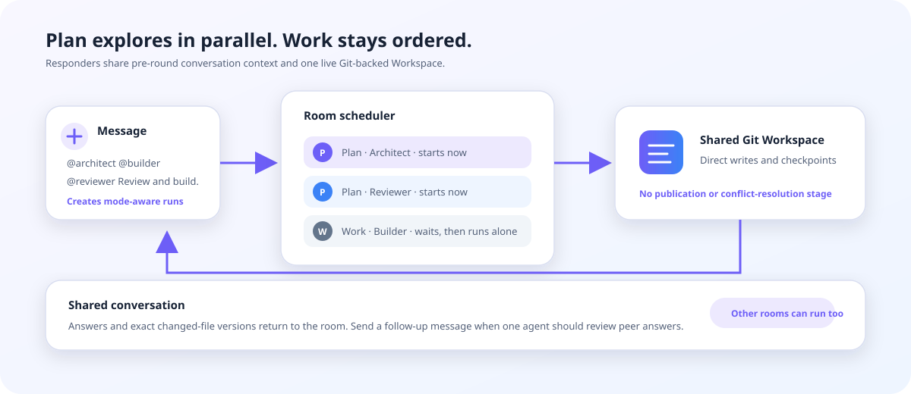

# Agenvyl

**One browser. Multiple coding agents. One shared workspace.**

Agenvyl is a local web interface that brings your already-installed coding
agents into shared rooms. Each tool keeps its own models, accounts, skills,
tools, and MCP integrations while Agenvyl coordinates the conversation,
the run queue, and shared files.


[](LICENSE)

**[Install](#quick-start)** · [See how it works](#how-it-works) ·
[Connect an agent](docs/harnesses/README.md) ·
[Read the documentation](docs/README.md)

## Why Agenvyl?

Coding agents usually live in separate terminals and chats. Their context,
files, and decisions become fragmented.

Agenvyl gives them one browser-based room:

- **Shared context** — later agents can read, critique, and combine completed
  answers from earlier turns.
- **Mode-aware runs** — Work agents run one at a time in a room so file edits
  stay ordered; Plan agents can explore in parallel.
- **Shared files** — agents work directly in the room Workspace. Agenvyl records
  Git checkpoints and keeps earlier file versions.
- **Your existing setup** — reuse each harness with its configured models,
  permissions, skills, tools, hooks, and MCP servers.

## How it works



1. Create a room for a project, review, experiment, or other task.
2. Add agents with different names, models, and instructions.
3. Send one message to an agent, several agents, or `@all`.
4. Review their completed answers and ask another agent to synthesize the
   result.

On desktop, collapse the left sidebar when you want more room for the
conversation; Agenvyl remembers that browser preference. Use the **+** menu by
the composer to attach files or open the room Workspace.

Agents launched by the same message receive the same pre-round conversation.
In Work, they enter a FIFO queue and run one at a time in that room; later Work
agents see files left by earlier runs but not peer answers from the same
message. In Plan, responders can run in parallel against the shared Workspace.
Runs in different rooms can also proceed in parallel, subject to the configured
global concurrency limit.

When an agent produces a static web build, Agenvyl captures it with that exact
response. Open the current app from the Workspace, inspect any response's build,
or compare build history without replacing the room's source files. Agenvyl
warns when later source changes make the latest captured build outdated.

A message without an `@mention` is saved in the room but starts no agent.

For components, persistence, retries, and security boundaries, read
[How Agenvyl works](docs/architecture/overview.md).

## Supported coding-agent harnesses

| Harness | Connection |
| --- | --- |
| [Codex CLI](docs/harnesses/codex.md) | Agenvyl starts the user-installed `codex app-server` |
| [Claude Code](docs/harnesses/claude.md) *(experimental)* | Agenvyl starts a fresh user-installed CLI process per attempt |
| [OpenCode](docs/harnesses/opencode.md) | Agenvyl connects to or manages an OpenCode server |
| [Antigravity / AGY](docs/harnesses/antigravity.md) | Agenvyl starts a fresh `agy --print` process per attempt |
| [Hermes](docs/harnesses/hermes.md) | Agenvyl connects to an authenticated local Hermes API Server |
| [Cursor CLI](docs/harnesses/cursor.md) *(experimental)* | Agenvyl starts a fresh headless `agent` process per attempt |

Agenvyl does not provide model access. The harness must already be installed or
running and authenticated on the same computer. One harness can power several
Agenvyl agents with different names, models, permissions, and instructions.

## Quick start

The downloadable app includes Node.js and PostgreSQL. You do **not** need
Docker, npm, or a source checkout.

Supported packages are Windows 10/11 x64, Linux x64/arm64, and macOS on Intel or
Apple silicon.

> [!WARNING]
> Agenvyl is an unsigned Technical Preview for a trusted, single-user computer.
> Read [Trust and security](docs/user-guide/trust-and-security.md) before
> accepting a SmartScreen or Gatekeeper warning.

### Windows

Open PowerShell:

```powershell
irm https://github.com/riffi/agenvyl/releases/latest/download/install.ps1 | iex
```

### Linux and macOS

Open a terminal:

```bash
curl -fsSL https://github.com/riffi/agenvyl/releases/latest/download/install.sh | sh
```

The installer verifies the selected archive, initializes the local stack,
detects supported harnesses, and opens the guided setup. If the browser does not
open, visit <http://127.0.0.1:8791>.

For archive installation, data locations, backups, updates, and uninstall, use
the [User Guide](docs/user-guide/installation.md).

## Your first room

New rooms start in **Plan** as **New room** and are named automatically from the
first substantive message. You can still rename a room manually from its
sidebar menu. Opening Agenvyl later returns you to the most recently active
room. This is the room with the newest message, not necessarily the room you
last viewed.

Ask every agent in the room for an independent proposal:

```text
@all Propose the best approach to this task from your perspective.
```

Then ask one agent to compare the completed results:

```text
@reviewer Read the answers above, evaluate their trade-offs, and synthesize the best plan.
```

Or guide a software workflow:

```text
@architect Read the project and propose a safe implementation plan.
@builder Implement the agreed plan and run the tests.
@architect @reviewer Check the change from different perspectives.
```

New rooms already have **Plan** enabled so agents can inspect and discuss the
project without implementing the request. Plan responders can run in parallel.
The compact mode button beside the composer shows **Plan** or **Work** with its
matching icon; select it when you are ready for ordered implementation. The
mode stays active for every new message and responder until you switch it
again. Native
Plan is the strongest mode each harness provides; an **Instruction-only** badge means the
harness has no technical read-only control and can still write with your
operating-system permissions.

Rooms are useful beyond software: research, writing, document review, planning,
and model comparison all use the same shared-history pattern.

## Local-first boundary

- The Web UI, product state, room history, and workspaces run on your computer.
- Agenvyl adds no telemetry or remote analytics.
- Connected harnesses use your normal operating-system permissions.
- A room workspace is a shared working directory, **not a security sandbox**.
- Plan protects the recommended external project through native harness controls
  where available, but it is not a universal operating-system sandbox.
- Do not enable a harness or permission profile you would not trust with the
  selected files.
- Agenvyl has no public multi-user authorization layer.

## Documentation

Use the [documentation map](docs/README.md) to choose a route:

- [Install and use Agenvyl](docs/user-guide/installation.md)
- [Work with rooms and agent runs](docs/user-guide/rooms-and-runs.md)
- [Use the command line and terminal control center](docs/user-guide/cli-and-control-center.md)
- [Work with Workspace files and previews](docs/user-guide/workspace.md)
- [Open and compare captured app builds](docs/user-guide/app-builds.md)
- [Register and use local projects](docs/user-guide/projects.md)
- [Connect an agent tool](docs/harnesses/README.md)
- [Understand the architecture](docs/architecture/overview.md)
- [Operate a custom deployment](docs/operations/deployment-boundaries.md)
- [Develop Agenvyl](docs/development/README.md)
- [Prepare a prerelease or stable release](docs/releases/README.md)

Contribution policy is in [CONTRIBUTING.md](CONTRIBUTING.md), and private
vulnerability reporting is in [SECURITY.md](SECURITY.md).

Agenvyl is licensed under the [Apache License 2.0](LICENSE).
