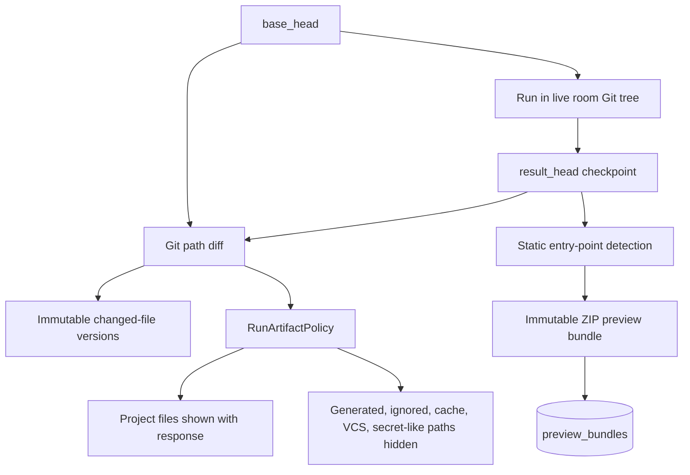
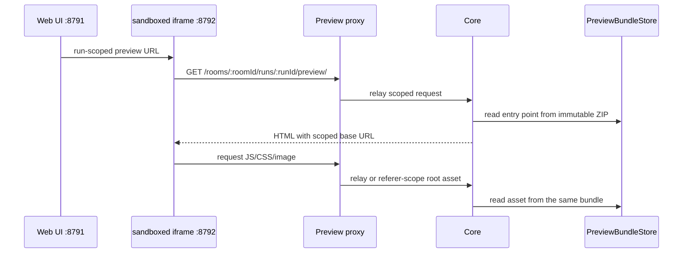

# App build architecture

This page describes static build detection, immutable bundle storage, current
selection, and preview serving. For user tasks, see
[App builds and previews](../user-guide/app-builds.md).

## Domain model and invariants

An app build is an immutable preview bundle captured from the live room
Workspace during terminal run finalization. It is not a Workspace snapshot and
is not read from mutable current files when served.

The implementation preserves these invariants:

- every preview bundle belongs to one room and one run;
- the bundle stores one recognized output root with a deterministic entry point;
- bundle files are immutable after successful publication to the artifact store;
- a historical selection never mutates Workspace state;
- a build is current only when `preview_bundles.source_head` equals the room's
  current Git HEAD;
- every preview asset resolves inside the selected bundle;
- a failed or cancelled run may have a bundle if terminal finalization captured
  usable output; and
- failed or oversized bundle capture does not fail Workspace finalization.

Shared contracts are `RoomStaticPreview`, `WorkspaceBuildPreview`,
`RunArtifact`, and `RunArtifactSummary` in `packages/contracts`.

## Capture flow



`RoomWorkspaceService.finalizeRun` asks `TransparentGitWorkspace` to commit
remaining changes, calculates changed paths between `base_head` and
`result_head`, captures exact versions for changed files, and applies
`RunArtifactPolicy` to the response projection.

The policy hard-hides generated output, dependencies, caches, tests, VCS data,
platform artifacts, and secret `.env*` paths except `.env.example`. It also
applies the root `.gitignore`; malformed ignore content is ignored rather than
failing capture. Hidden means omitted from the normal changed-file list. It
does not delete the file from the live working tree.

Static build detection uses the complete terminal tree, including recognized
generated output directories that are skipped by ordinary Workspace scanning.

## Static entry-point detection

`selectStaticPreviewPath` accepts `index.html` whose parent is `dist`, `build`,
or `out`, including nested projects. Candidates are ordered by:

1. output name: `dist`, then `build`, then `out`;
2. shallowest path; and
3. lexical path.

A root `index.html` is accepted only without a root `package.json`. A root
`package.json` plus root `index.html` without recognized output represents an
unbuilt web project.

Once selected, only the output directory containing the entry point is written
to the bundle. Paths are made relative to that output root.

## Preview bundle storage

`PreviewBundleStore` writes one ZIP and JSON metadata record below
`AGENVYL_ARTIFACT_ROOT`. Publishing uses a temporary directory followed by an
atomic rename. An existing bundle ID is accepted only when the SHA-256 matches;
different content for the same ID fails.

Both uncompressed and compressed sizes must be at or below
`AGENVYL_ARTIFACT_MAX_BYTES`, 250 MiB by default. Metadata records bundle hash,
compressed and uncompressed sizes, file paths, MIME types, hashes, and the
entry point.

PostgreSQL `preview_bundles` stores run/room ownership, `source_head`, entry
point, source manifest hash, bundle hash and sizes, file count, status, and
capture error. Only `ready` rows enter room history.

Deleting a room collects its preview IDs and removes the associated bundle
directories after database ownership has been resolved.

## Timeline projection and current selection

`WorkspaceRepository.artifactProjections` enriches terminal runs with visible
changed-file artifacts, total/project/hidden counts, and an optional preview.
`RoomWorkspaceService.resolveRoomPreviewProjection` builds ordered room history
from ready preview bundles.

Adjacent history entries with the same `bundle_sha256` receive
`sameBuildAsPrevious`. Run status does not affect equivalence.

Current selection is a Git identity comparison:

```text
preview.source_head === currentWorkspaceHead
```

The first matching history entry becomes `status: "ready"`. If no build
matches and the current tree is an unbuilt web project, history produces
`outdated`; no history produces `build_missing`. If the current tree is not an
unbuilt web project, Core returns history without a room-level static preview
state.

There are no publication status or conflict-count eligibility checks.

## Preview serving boundary



The Web UI uses a separate-origin iframe with
`sandbox="allow-scripts allow-same-origin allow-pointer-lock"`, normally on
`127.0.0.1:8792`. Pointer lock enables interactive 3D controls without removing
the other sandbox restrictions.

The preview Fastify app relays only immutable version-preview and run-preview
routes. A root-relative asset is redirected into a run scope only when a
same-host `Referer` identifies that scope and decoded path segments are safe.

Core resolves every run preview through the ready `preview_bundles` row and
reads the requested path from the matching ZIP. Traversal, absolute paths,
unsafe segments, missing assets, and cross-room/run lookups fail closed.

HTML receives a scoped `<base>`, CSP, `X-Content-Type-Options: nosniff`, and
inline disposition. Immutable resources use content hashes for ETag and
long-lived cache headers. The origin boundary reduces coupling to the product
UI but does not make generated application code trusted.

## Frontend state

`WorkspaceWindow` has independent `files | app` sections. `wsSection` and
`wsBuild` URL parameters make a historical run addressable. App selects the
explicit run, the current matching run, or the newest history item. An outdated
state requires the user to explicitly open the latest bundle.

`WorkspaceBuildPicker` renders order, agent, timestamp, run status,
`sameBuildAsPrevious`, and historical/current state. It has no publication or
conflict badges.

## Code map

| Responsibility | Location |
| --- | --- |
| Git prepare/finalize and changed paths | `apps/backend/src/modules/workspace/TransparentGitWorkspace.ts` |
| Finalization, capture, selection, scoped lookup | `apps/backend/src/modules/workspace/RoomWorkspaceService.ts` |
| Immutable bundle filesystem storage | `apps/backend/src/modules/workspace/PreviewBundleStore.ts` |
| Artifact visibility | `apps/backend/src/modules/workspace/RunArtifactPolicy.ts` |
| Entry-point rules | `apps/backend/src/modules/workspace/runStaticPreview.ts` |
| Version and bundle persistence | `apps/backend/src/modules/workspace/workspace.repository.ts` |
| Per-run Git result persistence | `apps/backend/src/modules/workspace/RunWorkspaceRepository.ts` |
| Core preview routes | `apps/backend/src/modules/workspace/workspace.routes.ts` |
| Separate-origin relay | `apps/backend/src/app/buildPreviewApp.ts` |
| App view and history | `apps/frontend/src/widgets/workspace-window/` |
| Cross-layer contracts | `packages/contracts/src/index.ts` |
