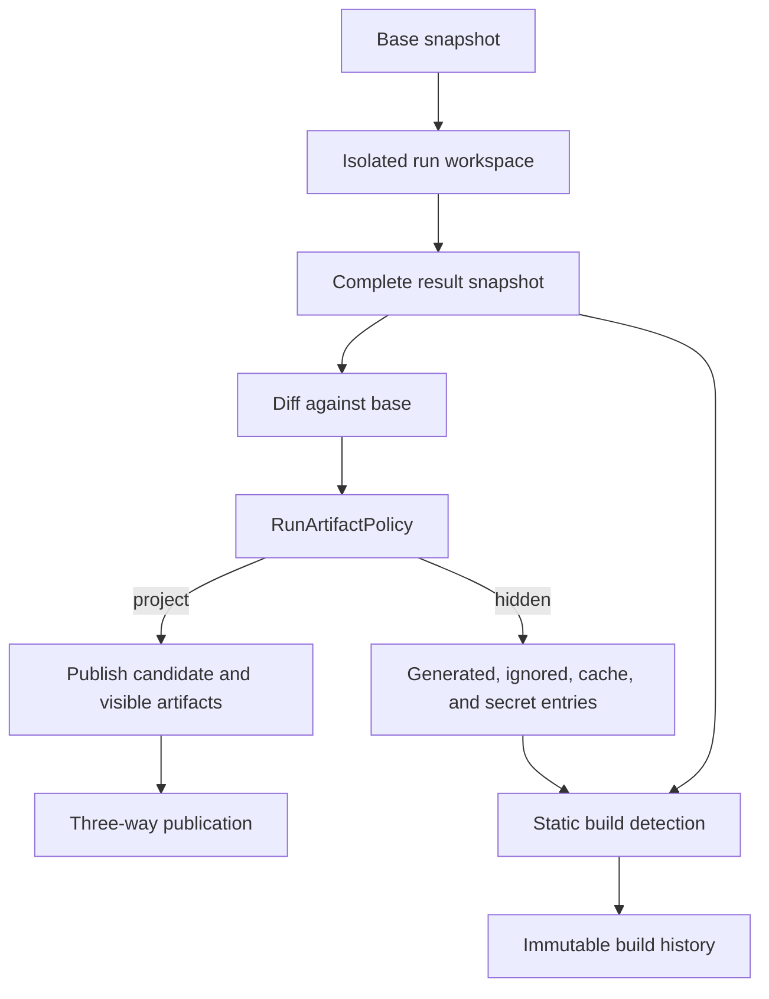
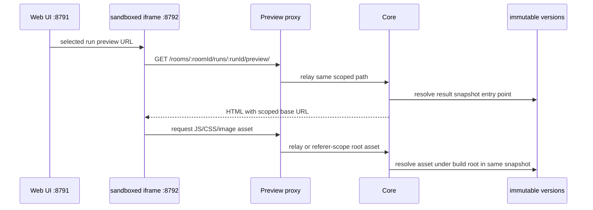

# App build architecture

This page describes how Agenvyl discovers, stores, selects, and serves static
app builds. For the task-oriented explanation, see
[App builds and previews](../user-guide/app-builds.md).

## Domain model and invariants

An app build is a projection of a terminal run's immutable result snapshot. It
is not a second mutable workspace and is not copied into the room's published
source tree.

The implementation preserves these invariants:

- every preview is scoped to one room, run, and result snapshot;
- generated output may be hidden from publication without being deleted from
  the result snapshot;
- selecting a historical build never mutates room state;
- a build is current only when a conflict-free published result still matches
  the current publishable project content;
- preview assets come from the same result snapshot and output root as the
  selected entry point; and
- incomplete captures never enter build history.

The shared contracts are `RoomStaticPreview`, `WorkspaceBuildPreview`,
`RunArtifact`, and `RunArtifactSummary` in `packages/contracts`. A room
workspace response contains an optional `staticPreview` state plus ordered
`previewHistory`.

## Capture, classification, and publication



`RoomWorkspaceService.finalizeRun` captures the complete isolated tree before
publication. `RunArtifactPolicy` then classifies every changed path as
`project` or `hidden` using two layers:

1. hard-hidden generated, dependency, cache, test, VCS, environment, and
   platform paths; and
2. rules from the result snapshot's root `.gitignore`.

Malformed `.gitignore` content is ignored rather than failing capture.
Negation rules work for ordinary ignored paths, but the hard-hidden set cannot
be re-enabled. The project candidate begins with the base snapshot and applies
only project-visible changes. Consequently, generated output stays in the run
snapshot while source changes participate in normal three-way publication.

`run_artifacts.visibility` persists the classification. Timeline projections
return only `project` artifacts and include total, project, and hidden counts.
Migration `028_run_artifact_visibility.sql` backfills the hard-hidden cases for
existing artifacts.

## Static entry-point detection

`selectStaticPreviewPath` evaluates normalized snapshot paths. It accepts an
`index.html` whose parent directory is `dist`, `build`, or `out`, including
nested projects. Candidates are ordered by:

1. output name: `dist`, then `build`, then `out`;
2. path depth, shallowest first; and
3. lexical path order for a deterministic tie-break.

A root `index.html` is accepted only when the same snapshot has no root
`package.json`. The root `package.json` plus root `index.html` combination is
the marker for an unbuilt web project; it produces `build_missing` when no
recognized output exists.

This convention deliberately supports static production output without
attempting to infer framework-specific commands or start arbitrary processes.

## Per-run projection and room history

There are two related projections:

- `WorkspaceRepository.artifactProjections` enriches runs shown in the room
  timeline with visible artifacts, counts, `staticPreview`, and
  `staticPreviewStatus`.
- `RoomWorkspaceService.resolveRoomPreviewProjection` builds the room-level
  current state and complete preview history.

`WorkspaceSnapshotRepository.previewCandidates` selects every room run with
`capture_status = complete` and a result snapshot, newest first. It does not
require a completed run or successful publication. This is why a failed,
cancelled, partially published, or unapplied run can remain inspectable when
its filesystem capture completed successfully.

For each candidate, Core selects the entry point and hashes the selected output
subtree by content. Adjacent equal output manifests produce
`sameBuildAsPrevious`; run status alone does not affect equivalence.

### Selecting the current build

The current preview is stricter than history. Core considers candidates whose
publication status is `published` or `noop` and whose conflict count is zero,
ordered by the publication result update time. It calculates a content
manifest for the current project-visible snapshot and compares it with each
candidate's project-visible result manifest.

The first exact match becomes:

```text
staticPreview = { status: "ready", runId, attachment }
```

If a published build exists but none matches the current project manifest, the
state is `outdated`. If Agenvyl detects an unbuilt web project and no eligible
published build exists, the state is `build_missing`. A partially published
result cannot become current even when it remains in history.

Because generated output is hidden from the project manifest, a source match
is not invalidated merely because `dist`, `build`, or `out` is absent from the
published Workspace.

## Preview serving boundary



The main Web UI receives `preview_origin` from Core and loads app HTML in an
iframe with `sandbox="allow-scripts allow-same-origin"` on a separate origin,
normally `127.0.0.1:8792`. The preview Fastify app relays only version,
snapshot, and run-preview routes to Core. A root-relative asset request is
redirected into a run scope only when its same-host `Referer` identifies that
scope and all decoded path segments are safe.

Core resolves the entry point again from the run's result snapshot. Every
asset is joined beneath that entry point's output directory and looked up in
the same snapshot. Traversal, absolute paths, unsafe segments, missing files,
and cross-room/run lookups fail closed.

HTML responses receive a scoped `<base>` element, CSP,
`X-Content-Type-Options: nosniff`, and inline disposition. Run and snapshot
resources use their content hash as an ETag and immutable one-year caching.
The CSP permits scripts and network access needed by generated apps, so the
origin boundary and iframe sandbox reduce coupling to the product UI but do
not make untrusted application code harmless.

## Frontend state and navigation

`WorkspaceWindow` has orthogonal `files | app` sections. `wsSection` and
`wsBuild` URL parameters make the selected section and historical run
addressable. The App section selects, in order, the explicitly requested run,
the current matching run, or the newest history item. An `outdated` state gates
implicit display until the user explicitly opens the latest build.

`WorkspaceBuildPicker` renders build order, agent, timestamps, run and
publication statuses, equality, and historical/current state.
`WorkspaceAppPreview` owns the ready, outdated, and unavailable presentations.
The timeline opens a response build with its run ID, preserving the exact
historical selection rather than redirecting to the current build.

## Code map

| Responsibility | Location |
| --- | --- |
| Capture, policy application, current/history selection, scoped asset lookup | `apps/backend/src/modules/workspace/RoomWorkspaceService.ts` |
| Project/hidden classification | `apps/backend/src/modules/workspace/RunArtifactPolicy.ts` |
| Entry-point rules | `apps/backend/src/modules/workspace/runStaticPreview.ts` |
| Candidate persistence queries | `apps/backend/src/modules/workspace/workspaceSnapshots.repository.ts` |
| Per-run artifact projection | `apps/backend/src/modules/workspace/workspace.repository.ts` |
| Core preview routes and response headers | `apps/backend/src/modules/workspace/workspace.routes.ts` |
| Separate-origin relay | `apps/backend/src/app/buildPreviewApp.ts` |
| App view and build history | `apps/frontend/src/widgets/workspace-window/` |
| Cross-layer types and events | `packages/contracts/src/index.ts` |

