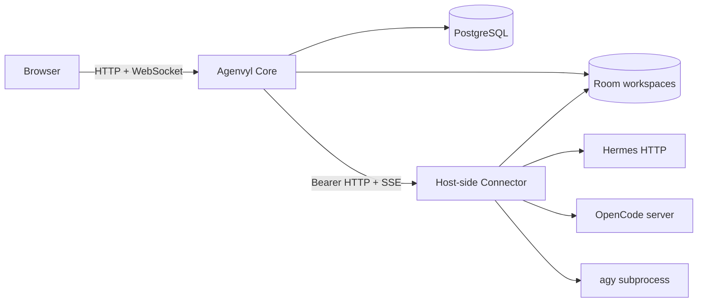
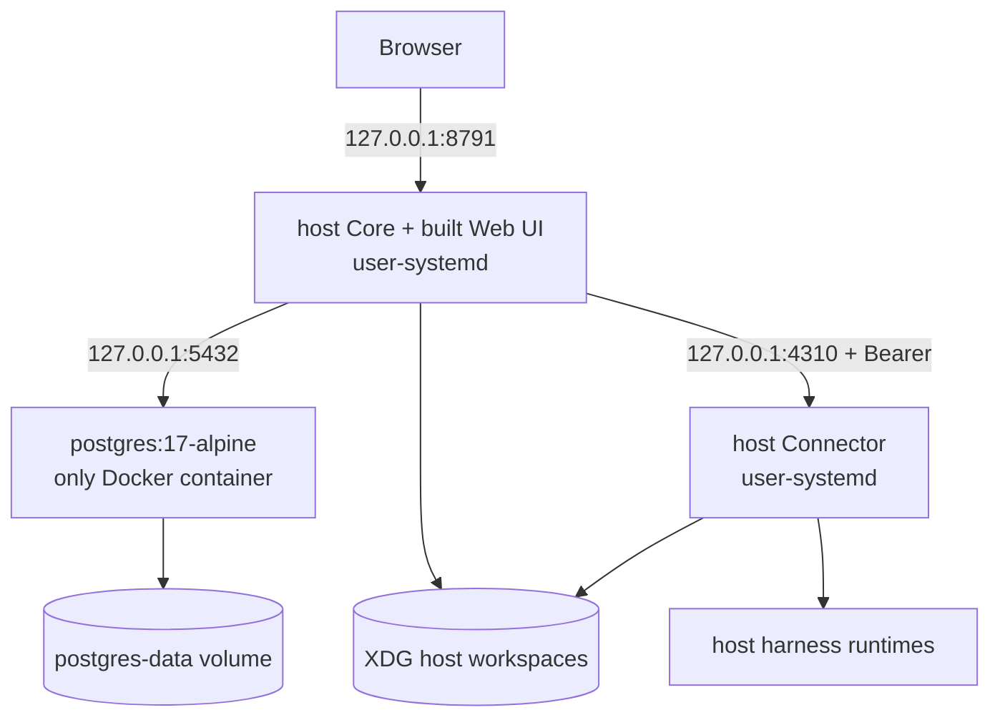

# Agenvyl architecture

This document describes the architecture implemented by the current OSS
repository. It is a product reference, not a migration plan or a record of
completed milestones.

## System context

Agenvyl is a room-first application for coordinating multiple coding-agent
harnesses. The system has two application processes and two durable storage
boundaries:



- **Core** is a Fastify modular monolith. It serves the built React application,
  REST API, and room WebSocket; owns product state and orchestration; and never
  reads harness credentials.
- **Connector** is the only execution boundary. It runs beside harness CLIs and
  credential stores, normalizes discovery and execution, and exposes a
  vendor-neutral versioned protocol to Core.
- **PostgreSQL** stores rooms, personas and immutable persona versions,
  messages, run snapshots, workspace metadata, and ordered room events.
- **Room workspaces** contain live files plus application-managed immutable
  versions. They are shared working directories, not security sandboxes.

## Portable production deployment

The production bundle runs Core, the built Web UI, and Connector on the host
under user-systemd. Docker runs only PostgreSQL:



Core and Connector resolve one XDG host workspace path, so no container path
mapping exists. `compose.yaml` is portable PostgreSQL configuration and binds
its published port to loopback. Operator-specific domains,
TLS, authentication proxies, supervisors, secrets, and reset policies belong
in a separate deployment layer. See
[OSS operations boundaries](../operations/oss-boundaries.md).

## Core structure

Core follows ports-and-adapters boundaries inside one process:

```text
apps/backend/src/
  app/                    composition root and Fastify plugins
  modules/                product use cases and repositories by capability
  integrations/connector Connector HTTP/SSE client and run adapter
  infrastructure/        PostgreSQL, migrations, realtime transport
  shared/                 validation, identity, and error mapping
```

Routes validate and translate HTTP input. Application services own use cases.
Repositories own persistence. Infrastructure code implements database,
WebSocket, static-file, and Connector transports. Backend boundary checks keep
vendor-specific code out of product modules.

Core currently assumes one backend process. `RunExecutor` owns an in-process
FIFO queue with bounded concurrency, while PostgreSQL remains the durable source
of truth for run state and recovery.

## Message and execution flow

1. Core stores the human message, target persona snapshots, queued runs, and
   initial room events in one PostgreSQL transaction.
2. Each run receives an immutable harness instance, harness type, model, mode,
   persona version, and pre-round conversation snapshot.
3. Core starts a Connector execution with a Core-owned execution ID and a
   canonical room-relative workspace identity.
4. Connector resolves the workspace, starts the selected adapter, assigns an
   execution epoch and monotonic cursors, and emits normalized SSE events.
5. Core commits each accepted cursor together with its projected room events.
6. The room WebSocket publishes only durable events. Reconnecting clients replay
   from the last applied room sequence.

Every attempt has exactly one terminal state. A retry creates a new attempt and
new upstream session or process while retaining the original immutable routing
and conversation snapshot.

## Connector protocol

The internal v1 HTTP surface is intentionally smaller than any harness API:

- health, instance discovery, and per-instance model/mode catalog;
- idempotent execution start and execution inspection;
- ordered SSE events with cursor-based bounded replay;
- stop and approval/clarification resolution commands.

Connector owns ephemeral execution processes and replay buffers. Core owns
durable product state. A Connector restart changes its epoch; Core never assumes
that a process from an older epoch is still alive. Same-epoch Core restarts can
reattach from the last durable Connector cursor without duplicating room events.

Adapter-controlled diagnostics, tool summaries, and request text pass through a
common redaction and size boundary before persistence or transport. Raw vendor
payloads are not part of the Core API.

## Harness adapters

| Adapter | Transport | Supported behavior |
| --- | --- | --- |
| Hermes | HTTP and event stream | catalog, text, tools, approvals, usage, cancel |
| OpenCode | pinned native SDK over HTTP/SSE | catalog and modes, text/reasoning, tools, approvals, one-question clarifications, usage, cancel |
| Antigravity | fresh `agy --print` subprocess | exact model/mode catalog, final text, POSIX process-group or Windows process-tree cancel |

OpenCode uses its native server and SDK because that path exposes the lifecycle
needed by Agenvyl without introducing a second translation layer. ACP is not a
current runtime dependency and can be reconsidered only if it provides the same
catalog, event, approval, clarification, cancellation, and recovery semantics.

Antigravity has no documented structured streaming or approval protocol.
Connector therefore does not fabricate tool, usage, or partial-output events.
Its autonomous `accept-edits` mode requires an explicit operator opt-in.

## Frontend structure and state

The React SPA is organized into directional layers:

```text
app -> pages -> widgets -> features -> entities -> shared
```

- TanStack Query owns server state and invalidation.
- `RoomEventStream` owns live room updates and replay sequencing.
- Local component state owns transient dialogs, drafts, drawers, and selection.
- Entity and feature public APIs prevent higher-level UI modules from becoming
  transport owners.

The production gateway uses the real REST/WebSocket transports. The fake gateway
is limited to explicit demo and test activation.

## Data and consistency invariants

- PostgreSQL migrations are forward-only and transactional.
- User messages are idempotent by client-provided message ID.
- Persona configuration is versioned; historical runs never consult the current
  catalog to reconstruct their route.
- Room event sequence numbers are allocated atomically per room.
- Connector cursor acceptance and room-event projection share one transaction.
- Only the selected completed attempt contributes to later conversation history.
- Workspace attachments reference immutable file versions, not mutable paths.

## Security boundary

- Connector binds to loopback by default and requires a token of at least 32
  characters.
- Harness endpoints, credentials, executable paths, and OAuth stores are
  host-side environment or native harness state; they do not enter Core.
- Connector canonicalizes configured workspace roots and rejects traversal,
  absolute request paths, symlink escape, missing targets, and ambiguous roots.
- Harnesses still execute with the permissions of the Connector host user.
  Workspace validation is not process sandboxing.
- Agenvyl contains no telemetry or remote analytics.

Operational details belong in the [runtime](../operations/runtime.md),
[Connector](../operations/connector.md), and
[database](../operations/database.md) guides.
