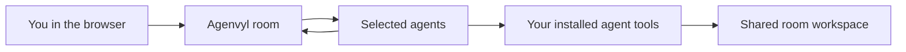
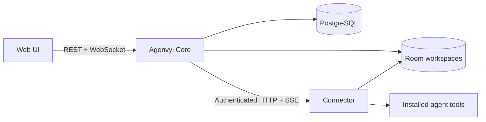
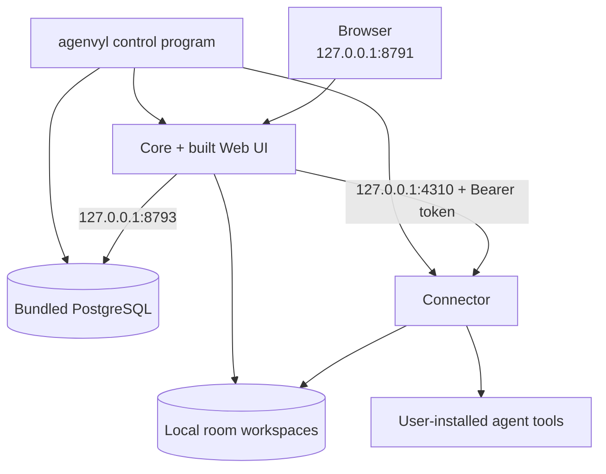

# How Agenvyl works

Agenvyl gives several coding agents one shared place to work. You use a room in
the browser; Agenvyl sends each request to the coding-agent tool already
installed on your computer and brings the results back into the same
conversation.

This page first explains that flow in user-facing terms, then describes the
technical boundaries for contributors and operators. It reflects the current
open-source implementation, not a future roadmap.

## The short version



- A **room** is a conversation with its own members and working folder.
- An **agent** is an Agenvyl persona: a name, instructions, model, permissions,
  and a connection to an installed coding-agent tool.
- A **coding-agent tool** (or *harness*) is the program that does the actual
  model and tool work, such as Codex CLI, Claude Code, OpenCode, Hermes, or AGY.
- The **workspace** is the folder shared by the agents in that room.

Agenvyl coordinates these parts. It does not provide model access and does not
replace the agent tools or their accounts.

## What happens when you send a message

Suppose a room contains `@architect`, `@builder`, and `@reviewer`.

1. You address one agent, several agents, or `@all`.
2. Agenvyl saves the message and creates one run for every addressed agent.
3. Agents addressed in the same message start independently and can run in
   parallel. They all receive the conversation as it existed before that round.
4. Each agent works through its configured tool and can see the same room
   workspace.
5. Agenvyl streams supported progress back to the room and saves the final
   result.
6. Completed results become context for later messages, so another agent can
   compare or combine them.

The agents in one round do not see one another's unfinished answers. Send a
follow-up message when you want an agent to review the completed answers from
that round. A message without an `@mention` is saved but starts no agent.

If you retry an answer, Agenvyl creates a separate attempt with the same saved
agent configuration and conversation snapshot. You can compare completed
attempts and select the one that should represent that answer in later context.

## The four main parts



### Web UI

The browser shows rooms, messages, runs, agent settings, and workspace files.
It talks only to Core. Live updates arrive over a room WebSocket; after a
disconnect, the UI can replay events it missed.

### Core

Core is the product backend. It:

- serves the Web UI and REST API;
- owns rooms, agents, messages, run state, and orchestration;
- decides which saved conversation and configuration belong to a run;
- publishes durable room events; and
- reads and versions room files.

Core is deliberately unaware of vendor credentials and does not start agent
tools directly.

### Connector

Connector is the bridge between Agenvyl and the tools installed on the
computer. It:

- discovers available tools, models, and controls;
- starts or contacts the selected tool;
- converts different tool protocols into one Agenvyl protocol;
- forwards progress, approvals, questions, results, and cancellation where the
  tool supports them; and
- keeps tool credentials and executable locations out of Core.

Connector is the only execution path: Core has no direct fallback to a vendor
tool.

### PostgreSQL and room workspaces

PostgreSQL stores product records: rooms, versioned agent configurations,
messages, run attempts, workspace metadata, and the ordered event history.

The filesystem stores live room files and application-managed immutable
versions. Message attachments point to a saved version, so a later edit does
not silently change an earlier message.

These are the two durable data locations. Backups need to cover both. See the
[data and backups guide](../user-guide/data-and-backups.md) for the supported
backup and restore workflow.

## How the installed app runs

The normal downloadable app is a local, single-user runtime for Windows, macOS,
and Linux. It includes its own Node.js and PostgreSQL, so it does not require
Docker, a system Node installation, systemd, launchd, or a Windows service.

The `agenvyl` control program initializes and starts the local stack in this
order:



Application data lives outside the replaceable app directory in the
platform-appropriate user data location. The source repository also supports a
development/server workflow in which PostgreSQL may run through Docker Compose,
while Core and Connector remain host processes so they can reach the same local
workspaces and agent tools.

Deployment-specific domains, TLS, authentication proxies, service managers,
and secrets are outside the product repository. See
[deployment boundaries](../operations/deployment-boundaries.md).

## Supported tool integrations

| Tool | How Connector uses it |
| --- | --- |
| Hermes | Connects to an existing local HTTP service |
| OpenCode | Connects to, or manages, an OpenCode server |
| Codex CLI | Starts the user-installed `codex app-server` |
| Claude Code CLI *(experimental)* | Starts a fresh user-installed `claude` process for each attempt and routes unresolved permissions through a shared loopback MCP bridge |
| Antigravity / AGY | Starts a fresh `agy --print` process for each attempt |

Connector reports only behavior an integration can represent safely. The
[harness capability matrix](../harnesses/capabilities.md) compares the current
configuration, output, interaction, and lifecycle support without duplicating
those details here. Setup, version, authentication, and safety requirements are
documented in the [harness guides](../harnesses/README.md).

## Files, history, and retries

Several rules keep a room understandable and reproducible:

- Each room has one canonical workspace directory.
- Direct agent writes are detected and versioned by Agenvyl.
- Attachments refer to immutable versions rather than mutable paths.
- Every run saves the exact agent version, tool instance, model, execution
  controls, and conversation snapshot it started with.
- Every attempt ends once as completed, failed, or cancelled.
- A retry is a new attempt; it does not rewrite the original attempt.
- Only the selected completed attempt is included in later conversation
  history.

Experimental Plan Mode adds a versioned `plan.md`, explicit plan approval, and
an implementation handoff. It is disabled by default and does not change the
basic room and run model.

## Reliability model

Core stores the human message, run snapshots, and initial room events in one
database transaction. It then schedules runs through an in-process FIFO queue
with bounded concurrency.

Connector gives every execution a process-lifetime epoch and ordered event
cursors. Core saves an accepted cursor and the room events derived from it in
the same database transaction. This lets the system:

- avoid duplicate room events after reconnecting;
- resume a run after a same-epoch Core restart when replay is still available;
- detect that Connector restarted and an old execution can no longer be
  trusted; and
- replay durable room events to a reconnecting browser.

The current design intentionally assumes one Core process. PostgreSQL is the
durable source of truth, but the run queue itself is not distributed.

## Security and trust

Agenvyl is local-first, but local does not mean sandboxed:

- Core does not receive harness credentials. Connector reads them from
  environment variables or the tool's own credential store.
- Core, Connector, and bundled PostgreSQL bind to loopback in the personal
  runtime. Connector also requires a token of at least 32 characters.
- Connector validates room workspace paths and rejects traversal, absolute
  request paths, symlink escapes, missing targets, and ambiguous roots.
- Agent tools still run with the permissions of the operating-system user who
  started Agenvyl. A workspace is a shared working directory, **not a security
  boundary**.
- Agenvyl adds no telemetry or remote analytics. Connected tools may retain
  their own network, telemetry, hook, and plugin behavior.

Do not enable a tool or permission mode that you would not trust with the
selected files. Put an authenticated TLS reverse proxy in front of Core before
any non-loopback or multi-user exposure.

## Code map for contributors

Core is a Fastify modular monolith with ports-and-adapters boundaries:

```text
apps/backend/src/
  app/                    composition root and Fastify plugins
  modules/                use cases and repositories by product capability
  integrations/connector Connector HTTP/SSE client and run adapter
  infrastructure/        PostgreSQL, migrations, HTTP, and realtime transport
  shared/                 validation, identity, and error mapping
```

Routes validate and translate HTTP input. Services own use cases, repositories
own persistence, and infrastructure code owns database and transport details.
Boundary checks keep vendor-specific behavior out of product modules.

The React frontend uses directional layers:

```text
app -> pages -> widgets -> features -> entities -> shared
```

TanStack Query owns server state, `RoomEventStream` owns live updates and replay
sequencing, and local component state owns temporary UI such as dialogs,
drawers, drafts, and selections.

Connector adapters live under:

```text
apps/connector/src/adapters/
  hermes/
  opencode/
  codex/
  claude/
  antigravity/
```

Shared Core/Connector request and event shapes are versioned in
`packages/connector-contract`. Mixed protocol versions are rejected.

For operational detail, continue with the [runtime](../operations/runtime.md),
[Connector](../operations/connector.md), and
[database](../operations/database.md) guides.
