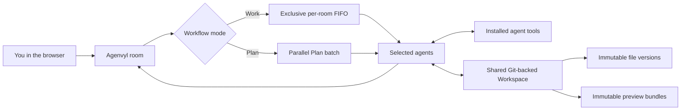
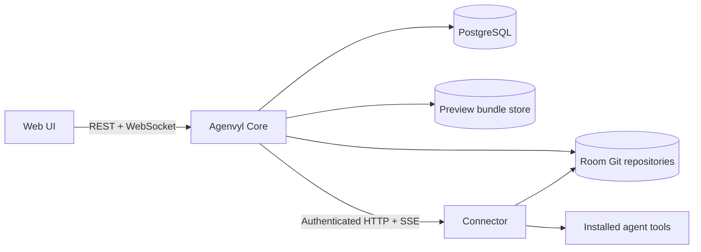
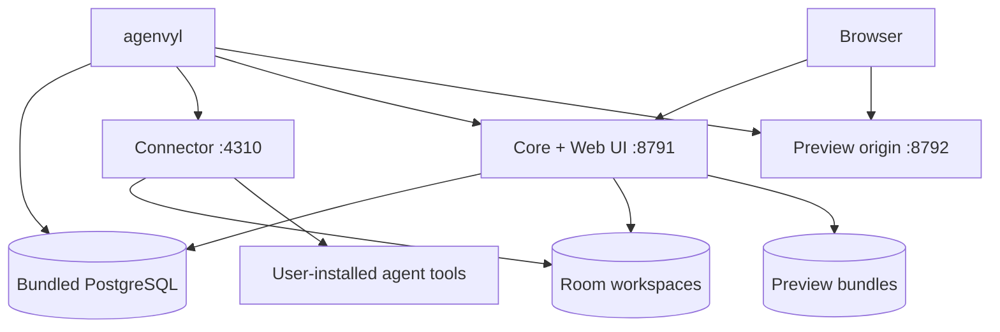
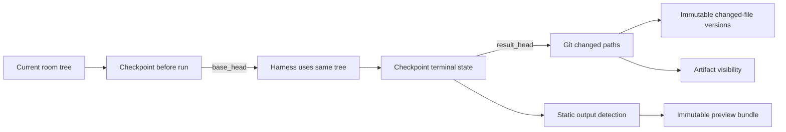

# How Agenvyl works

Agenvyl gives several coding agents one shared place to work. A room combines a
conversation, personas, run history, and one live Git-backed Workspace. Core
queues work, Connector talks to installed agent tools, and results return to the
same browser conversation.

This page describes the current implementation for contributors and operators.

## Product model


```mermaid
flowchart LR
  User[You in the browser] --> Room[Agenvyl room]
  Room --> Mode{Workflow mode}
  Mode -->|Work| Queue[Exclusive per-room FIFO]
  Mode -->|Plan| Parallel[Parallel Plan batch]
  Queue --> Agents[Selected agents]
  Parallel --> Agents
  Agents <--> Tools[Installed agent tools]
  Agents <--> Files[Shared Git-backed Workspace]
  Agents --> Room
  Files --> Versions[Immutable file versions]
  Files --> Builds[Immutable preview bundles]
```

- A **room** is a conversation with members and one working folder.
- An **agent** is a persona version: name, instructions, model, permissions,
  and a selected harness instance.
- A **harness** is the installed tool that performs model and tool work, such as
  Codex CLI, Claude Code, OpenCode, Hermes, AGY, or Cursor CLI.
- The **Workspace** is the room's live Git working tree. Runs use it directly.
- A **project** is an optional external directory recommended in run context.
  It is not the process working directory, access grant, or sandbox boundary.
- A **preview bundle** is immutable static build output captured for one run and
  stored outside the live Workspace.

Agenvyl coordinates these parts. It does not provide model access or replace a
harness account.

## Message and run flow

Suppose a room contains `@architect`, `@builder`, and `@reviewer`.

1. The user addresses one or more agents, or `@all`.
2. Core persists the message, one run per responder, immutable persona and
   execution-profile snapshots, initial room events, and the pre-round
   conversation context in one transaction.
3. Runs enter the process-local scheduler. Global concurrency is bounded. Work
   runs are exclusive and preserve FIFO order within the room; Plan runs can
   start together while no earlier or active Work run forms a barrier.
4. Immediately before a queued run starts, Core refreshes conversation context
   through the current message boundary. Responders from the same message still
   receive the same pre-round conversation; they do not receive peer answers
   from that message.
5. `RoomWorkspaceService.prepareRun` commits dirty room files if necessary,
   records the resulting Git HEAD as `base_head`, and passes the room's own
   Workspace path to Connector.
6. The harness runs in that live folder. Work starts alone and sees the state
   left by earlier runs. Plan responders can inspect the same folder
   concurrently.
7. Finalization commits remaining changes, records `result_head`, stores exact
   versions for changed paths, classifies response artifacts, and optionally
   captures a static preview bundle.
8. Selected completed answers become context for later messages. A retry creates
   a new attempt and preserves the original run's saved configuration and
   workflow mode.

Parallel Plan and runs in different rooms share the
`AGENVYL_RUN_CONCURRENCY` limit. Work is a FIFO barrier: it waits for earlier
Plan runs and prevents later Plan runs from overtaking it. This scheduler policy
does not protect an external project shared by concurrent runs.

Plan execution overlaps, but Core serializes the short Workspace prepare and
finalization sections per room. This prevents concurrent Git index operations
from colliding; it does not isolate instruction-only Plan writes made between
those sections.

A message without an `@mention` is persisted but creates no run.

New rooms default to Plan. PostgreSQL applies that default when a room is
created; changing the default does not rewrite existing rooms. The selected
room mode remains sticky until it is explicitly toggled.

## Main components


```mermaid
flowchart LR
  Browser[Web UI] -->|REST + WebSocket| Core[Agenvyl Core]
  Core --> Database[(PostgreSQL)]
  Core --> Workspace[(Room Git repositories)]
  Core --> Artifacts[(Preview bundle store)]
  Core -->|Authenticated HTTP + SSE| Connector[Connector]
  Connector --> Workspace
  Connector --> Harnesses[Installed agent tools]
```

### Web UI

The browser shows rooms, messages, runs, agent settings, current Workspace
files, immutable file versions, and app builds. It talks only to Core. Room
events arrive over WebSocket and replay after a disconnect.

The base route loads setup and the room list, then redirects to the room ordered
first by backend activity: newest room message, falling back to room creation
time. It does not persist a last-viewed-room preference.

### Core

Core is the Fastify product backend. It owns product state, scheduling,
conversation projection, Workspace checkpoints, immutable file versions,
preview bundles, and durable room events. Vendor credentials and executable
locations do not enter Core.

### Connector

Connector discovers harnesses and models, starts or contacts the selected tool,
normalizes progress and interaction, and keeps harness-specific credentials out
of Core. It is the only execution path; Core has no direct vendor fallback.

### Durable storage

There are three coordinated durable data locations:

- PostgreSQL stores rooms, projects, persona versions, messages, run attempts,
  `base_head`/`result_head` capture metadata, immutable-version references,
  preview-bundle metadata, and ordered events.
- The Workspace root stores one live Git repository per room plus the
  content-addressed `.versions` object store.
- The Artifact root stores immutable ZIP preview bundles and their metadata.

A recoverable backup must contain matching copies of all three. Configuration
and secrets are separate operational state.

## Installed application

The downloadable single-user runtime includes Node.js and PostgreSQL. The
`agenvyl` supervisor starts bundled PostgreSQL, Connector, Core with the built
Web UI, and the separate preview origin.


```mermaid
flowchart TB
  Control[agenvyl] --> Database[(Bundled PostgreSQL)]
  Control --> Connector[Connector :4310]
  Control --> Core[Core + Web UI :8791]
  Control --> Preview[Preview origin :8792]
  Browser --> Core
  Browser --> Preview
  Core --> Database
  Core --> Workspace[(Room workspaces)]
  Core --> Artifacts[(Preview bundles)]
  Connector --> Workspace
  Connector --> Harnesses[User-installed agent tools]
```

Personal data lives outside replaceable application versions. Development and
custom deployments can use an external PostgreSQL instance, but Core and
Connector must resolve the configured Workspace to the same files.

## Workspace invariants

- Every room folder is a visible Git repository. New folders are initialized on
  `main` with an Agenvyl-authored initial commit.
- A run uses the room folder directly; there are no per-run worktrees,
  publication snapshots, workspace slots, or three-way conflict records.
- Work is the only exclusive writer mode. Multiple Plan runs can be active in a
  room, but an active or earlier queued Work run blocks them. Direct Workspace
  mutations are rejected with `workspace_writer_active` while any run is
  active.
- Prepare records `base_head`; finalization records `result_head` and optional
  `checkpoint_sha`. Changed paths come from `git diff base_head result_head`.
- Failed and cancelled runs are finalized too, so their filesystem side effects
  can be checkpointed and exposed as changed files.
- Merge, rebase, cherry-pick, revert, and bisect markers cause prepare or
  finalization to fail closed until the Git operation is completed or aborted.
- `.git`, `.versions`, and `.agenvyl` are reserved from public Workspace
  mutations. Immutable attachment and artifact references resolve through
  saved versions, not later live bytes.
- UI uploads, moves, restores, and deletions create their own Git checkpoints.
- `plan.md` is an ordinary file. Plan is a sticky execution-profile snapshot,
  not a special Workspace artifact.

### Finalization and artifacts


```mermaid
flowchart LR
  Dirty[Current room tree] --> Prepare[Checkpoint before run]
  Prepare -->|base_head| Run[Harness uses same tree]
  Run --> Final[Checkpoint terminal state]
  Final -->|result_head| Diff[Git changed paths]
  Diff --> Versions[Immutable changed-file versions]
  Diff --> Policy[Artifact visibility]
  Final --> Detection[Static output detection]
  Detection --> Bundle[Immutable preview bundle]
```

`RunArtifactPolicy` hides generated, dependency, cache, test, VCS,
environment-secret, and root `.gitignore` matches from normal response file
lists. This classification does not remove live files. Recognized static output
is copied to a preview bundle before history projection.

A build is current when its stored `source_head` equals the room's current Git
HEAD. Otherwise a recognized unbuilt web project produces `outdated` when
history exists or `build_missing` when it does not. See
[App build architecture](app-builds.md).

## Workflow mode and lifecycle controls

Each room stores sticky `plan | work` state. Message creation locks the room and
copies that mode into every responder run. Retry copies the original run's
execution profile.

The scheduler uses that immutable run profile. Plan runs may execute in
parallel until an earlier Work run is encountered. Work requires no active run
in the room and no earlier same-room pending run, making it an exclusive FIFO
barrier between Plan batches.

Native Plan is expected to remain read-only. Instruction-only Plan does not
enforce that invariant, so concurrent Plan harnesses can race in the shared
Workspace or an external project. Finalization records the resulting live Git
state but cannot reconstruct isolated per-agent changes.

The Plan instruction contract treats MCP calls as a confirmation-gated
exception to the external-system restriction. Before any MCP call, the harness
must open structured clarification for a bounded batch identified by
integration, target, operations, and side effects. A positive answer scopes the
exception to that batch and run without changing the immutable workflow
snapshot. Harnesses without structured clarification must stop before the MCP
call and return analysis or a draft instead.

Add instruction is supported by Codex and OpenCode. It interrupts the active
native turn, preserves the preceding answer segment with author, timestamp, and
status, then continues in the same native session and run. A selected completed
response can also create a linked run from its retained native session. It does
not roll back tool or Workspace side effects.

## Reliability model

The scheduler is process-local and intentionally assumes one Core process.
PostgreSQL is durable, but the queue is not distributed.

Connector executions use a process epoch and ordered cursors. Core commits an
accepted cursor with its projected room events, enabling same-epoch reattach,
deduplication, and browser replay. A Connector restart or unavailable replay
window fails the run closed and leaves it retryable.

At startup, Core also finds terminal runs whose Workspace capture remains
`ready` or `finalizing` and retries finalization against their room repository.

## Security and trust

- Core, Connector, preview server, and bundled PostgreSQL bind to loopback in
  the personal runtime.
- Connector requires a generated token and owns harness credentials.
- Harnesses run with the operating-system user's permissions. The Workspace is
  a shared working directory, not a sandbox.
- A recommended external project grants no access and adds no isolation.
- Different rooms may access the same external path concurrently.
- Rendered app builds run on a separate sandboxed origin, but generated code can
  still use network capabilities allowed by preview policy.
- Agenvyl adds no telemetry; connected tools keep their own network, telemetry,
  hook, plugin, and MCP behavior.

Put an authenticated TLS reverse proxy in front of Core before non-loopback or
multi-user exposure.

## Code map

Core is a Fastify modular monolith:

```text
apps/backend/src/
  app/                    composition root and Fastify plugins
  modules/                product use cases and repositories
  integrations/connector Connector HTTP/SSE client and run adapter
  infrastructure/        PostgreSQL, migrations, HTTP, realtime transport
  shared/                 validation, identity, error mapping
```

The React frontend follows `app -> pages -> widgets -> features -> entities ->
shared`. Connector adapters live under `apps/connector/src/adapters/`. Shared
Core/Connector protocol shapes are versioned in `packages/connector-contract`.

Continue with [runtime policy](../operations/runtime.md),
[Connector operations](../operations/connector.md), and
[database migrations](../operations/database.md).
