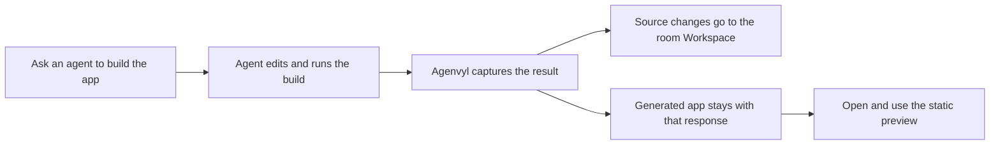

# App builds and previews

An app build is the runnable static website captured from one agent response.
It is a frozen result of that run, not a live view of the room files. Agenvyl
keeps it with the response so you can open the exact app the agent produced,
compare it with earlier builds, and tell when the room's source files have
changed since it was made.

## The simple model



Think of the room Workspace as the current editable project and a build as a
photograph of the runnable app at one moment. Opening an older photograph does
not roll back the files or change the current app.

The word *build* on this page is separate from an agent tool's **Build** mode or
agent variant. A Build-mode agent may create one, but Agenvyl recognizes the
captured files, not the name of the mode that produced them.

## Create a previewable build

Ask an agent to implement the change and run the project's production build.
For example:

```text
@builder Implement the requested page, run the production build, and verify it.
```

Agenvyl recognizes a static app when the captured result contains an
`index.html` in one of these output directories:

1. `dist/`
2. `build/`
3. `out/`

The directories may be at the workspace root or inside a subdirectory, such as
`apps/site/dist/index.html`. If several outputs exist, Agenvyl uses the order
above, then the shallowest path. A root `index.html` is also previewable for a
plain static site that has no root `package.json`.

For a web project with both a root `package.json` and root `index.html`, the
source entry page alone is not treated as a build. The agent must run the build
pipeline and leave its output in `dist`, `build`, or `out`. Otherwise the
response says **Preview unavailable · Build output not found**.

## Open the current build

There are two entry points:

- Select **Open this build** below an agent response to open the exact build
  captured for that response.
- Open the room Workspace and select **App** to open the build that matches the
  current source files. Select **Files** to return to the editable file tree.

The current build is not simply the most recent item in history. Agenvyl marks
a build current only when its source changes were applied without unresolved
conflicts and the room's current project files still match the captured
project. This prevents an old app from looking current after later edits.

If source files changed after the last matching build, the App view shows
**App preview is out of date**. You can:

- select **Open latest build anyway** to inspect the most recent applied build;
  or
- select **View files** and ask an agent to build the current source again.

## Compare build history

In the App view, open the build selector in the header. Every captured build
shows the agent, time, run result, and publication result. The badges mean:

| Badge | Meaning |
| --- | --- |
| **Current** | This build matches the room's current project files. |
| **Completed**, **Failed**, **Cancelled** | How the agent run ended. A failed or cancelled run can still have a complete captured build. |
| **Applied** | Its project-file changes were published to the room. |
| **Partially applied** | Some project paths conflicted; the build is kept for inspection but is not current. |
| **No source changes** | The run produced no new publishable project changes. |
| **Not applied** | The captured result did not become the room's published source state. |
| **Same build as previous** | The files in this build output are byte-for-byte equivalent to the preceding build in history. |
| **Historical** | You deliberately opened an older or otherwise non-current build. |

Selecting a historical build changes only the preview. Use the return button
beside the selector to go back to the current build or current App state.

## What happens to generated files

Changes inside generated output and dependency directories are intentionally
kept out of the response's project-file list and automatic publication. This
includes `dist`, `build`, `out`, `node_modules`, framework caches, test output,
local virtual environments, secret `.env*` files other than `.env.example`, and
paths ignored by the captured root `.gitignore`.

These files are not thrown away. They remain inside the immutable run snapshot
so the build can load its HTML, JavaScript, CSS, images, fonts, and other assets
exactly as captured. The response focuses on source changes instead of listing
thousands of generated files.

## Limits and troubleshooting

- App preview serves captured static files; it does not start a development
  server, application server, or server-side rendering process.
- Assets must be present below the selected output directory. Missing captured
  assets return not found instead of falling through to current Workspace
  files.
- Client-side code can make network requests allowed by the preview policy, so
  a build that depends on an unavailable API may render only partially.
- Each captured file must fit the workspace file-size limit. An oversize,
  unreadable, unsafe, or unstable result makes capture incomplete and prevents
  that run from becoming a build-history candidate.
- If the App view reports an outdated build, rebuild after the latest source
  changes. If it reports no captured build, confirm the production command
  actually created `dist/index.html`, `build/index.html`, or `out/index.html`.

Build HTML runs in a sandboxed iframe on the separate preview origin. Treat
generated code as code you are choosing to run, especially if it came from an
untrusted prompt, dependency, or project. See
[Trust and security](trust-and-security.md#file-preview-boundary).
