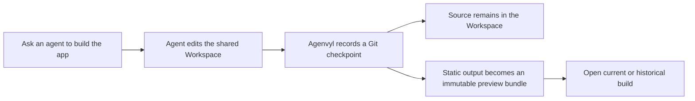

# App builds and previews

An app build is a static website captured when an agent run finishes. It is a
frozen preview stored separately from the editable room Workspace. You can open
the exact app associated with a response, compare builds, and see when source
files have changed since a build was captured.

## The simple model



Opening a historical build does not restore files or change the current build.

## Create a previewable build

Ask an agent to implement the change and run the production build:

```text
@builder Implement the requested page, run the production build, and verify it.
```

Agenvyl recognizes `index.html` in these output directories, in this order:

1. `dist/`
2. `build/`
3. `out/`

They can be at the Workspace root or inside a subdirectory such as
`apps/site/dist/index.html`. Agenvyl prefers the directory order above, then
the shallowest path. A root `index.html` is also accepted for a plain static
site without a root `package.json`.

When a root `package.json` exists, a root source `index.html` is not treated as
production output. If no supported output exists, the response reports
**Preview unavailable · Build output not found**.

## Open the current build

- Select **Open this build** below an agent response to open that run's exact
  captured bundle.
- Open Workspace and select **App** to open the build whose source checkpoint
  matches the current Workspace Git checkpoint.

The current build is not necessarily the newest history entry. If the
Workspace changed after capture, App shows **App preview is out of date**. You
can open the latest build for inspection or return to Files and ask an agent to
build the current source.

If the current files do not look like an unbuilt web project, Agenvyl can show
Files without an App warning even when historical builds exist.

## Compare build history

Open the build selector in App. Each entry shows its agent, time, and run
result.

| Badge | Meaning |
| --- | --- |
| **Current** | The build's source checkpoint matches the current Workspace Git checkpoint. |
| **Completed**, **Failed**, **Cancelled** | How the run ended. A failed or cancelled run can still leave a usable captured build. |
| **Captured** | A historical record whose run status is not one of the terminal labels above. |
| **Same build as previous** | The immutable preview bundle is byte-for-byte equivalent to the preceding build in history. |
| **Historical** | You explicitly opened a build that is not the current selection. |

Selecting a historical build changes only the preview. Use the return button to
go back to the current build or current App state.

## What is stored

Source files remain in the shared Workspace. The generated output directory is
copied into a separate immutable preview bundle so HTML, JavaScript, CSS,
images, fonts, and other assets continue to match that response.

Generated output, dependencies, caches, tests, local virtual environments,
secret `.env*` files other than `.env.example`, VCS metadata, and root
`.gitignore` matches are hidden from the normal response file list. Hiding them
keeps the timeline focused and does not change the files present in the live
Workspace.

Preview bundles live in Agenvyl's separate `artifacts/` data directory. A
complete backup must include that directory as well as PostgreSQL and the
Workspace root.

## Limits and troubleshooting

- Preview serves static files only. It does not start development servers,
  application servers, or server-side rendering.
- Every asset must be present below the captured output directory. Missing
  assets do not fall through to current Workspace files.
- Client-side code can make requests allowed by the preview policy. A build
  that depends on an unavailable API may render only partially.
- The preview-bundle limit is 250 MiB by default and applies to both compressed
  and uncompressed bundle size. Operators can change it with
  `AGENVYL_ARTIFACT_MAX_BYTES`.
- Individual captured Workspace files remain subject to
  `AGENVYL_WORKSPACE_MAX_FILE_BYTES`, 50 MiB by default.
- If App is out of date, rebuild after the latest source change. If no build is
  available, confirm the production command created a supported output path.

Build HTML runs in a sandboxed iframe on the separate preview origin. Treat
generated code as code you choose to run. See
[Trust and security](trust-and-security.md#file-preview-boundary).

Interactive builds can request pointer lock after a click for first-person
mouse controls. Press **Escape** to release the pointer.
