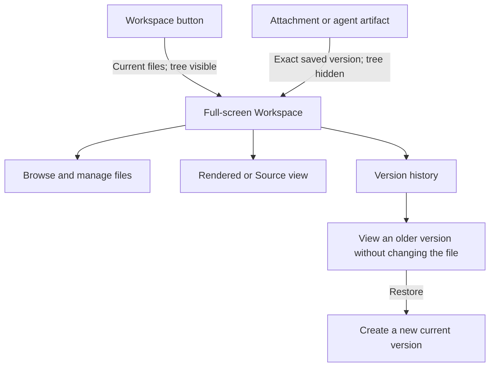

# Workspace and file previews

Each room has a Workspace for files shared across its conversation. Agenvyl
keeps earlier file versions, lets you preview agent output, and protects
parallel work from silently overwriting newer changes.

## At a glance

## Open the Workspace

There are two common entry points:

- Select **Workspace** beside the message composer to open the full-screen
  Workspace with the file tree visible.
- Select an attachment, image, or agent artifact to open that exact saved
  version as a full-screen preview. The file tree starts hidden so the content
  uses the available space.

Use the panel button at the left of the header to show or hide the file tree.
On desktop, drag the tree's right edge to resize it. Agenvyl remembers the
width on that browser.

## Use the header

The single-line header keeps the current context and its main controls
together:

- **Workspace / filename** identifies the open file.
- The eye and code icons switch between **Rendered** and **Source** when both
  views are available.
- The arrows move through older and newer versions. Select the `N / M`
  counter to open the complete version history.
- The actions menu contains the operations available for the selected file,
  such as Attach, Download, Restore, Rename, Move, Delete, and Refresh.
- The close button exits the Workspace.

Hover over an icon to see its label.

## Browse and manage files

The file tree supports:

- searching by file or folder name;
- uploading from the toolbar or by dropping files onto the tree;
- creating folders;
- renaming, moving, and deleting files;
- opening **Trash** and restoring deleted files; and
- opening a file's current version.

Double-click a normal file in the tree to rename it. File operations are also
available from the header menu after selecting the file.

The upload picker accepts up to 10 files in one action. If a file already
exists, Agenvyl asks whether to save the upload as a new version. The default
workspace file limit is 50 MiB; an operator can configure a different limit.
Uploads above the configured limit are rejected. Larger files written by an
external program or agent can appear as `oversize`, but cannot be versioned or
attached.

## Preview and inspect files

The available view depends on the file:

| File type | Available view |
| --- | --- |
| HTML, Markdown, SVG | Rendered and Source |
| Source code, JSON, configuration, logs, and text | Source |
| Images and PDF | Rendered |
| Unsupported binary content | File information and Download |

Rendered HTML opens in an isolated preview context. Source always displays the
saved bytes as text and does not execute HTML or SVG. See
[Trust and security](trust-and-security.md#file-preview-boundary) before
opening unfamiliar generated content.

### Source controls

Source view detects UTF-8 and common encodings automatically. If text looks
incorrect, use **Encoding** to choose UTF-8, UTF-16 LE/BE, Windows-1251,
Windows-1252, or KOI8-R. Changing the display encoding does not modify the
saved file.

The source toolbar can wrap long lines and copy the decoded text. On desktop,
the read-only code viewer also provides line numbers, search, folding, and
syntax highlighting. Compact and mobile layouts use a lighter read-only
viewer.

Source preview has separate display limits:

- up to 1 MiB: full syntax highlighting;
- above 1 MiB and up to 5 MiB: plain text without highlighting;
- above 5 MiB: no inline source preview; use Download.

These display limits do not change the workspace upload limit.

## Work with file versions

The version counter shows the selected version and the total history. Its
history list identifies:

- **Current** — the version currently published in the room Workspace;
- **Viewing** — an older version open without changing the current file; and
- **Approved** — the approved `plan.md` version when Plan Mode is enabled.

Opening an older version is read-only and does not change the file. Select
**Restore this version** from the actions menu to create a new current version
with the older content. Restore never erases the intervening history.

When you open a current file, the viewer follows new versions and reports when
the current version changes. After you deliberately select an older version,
that historical view remains pinned. Renaming or moving a file does not remove
its version history.

## Attach and download a version

**Attach** adds the version currently being viewed to the message composer.
The attachment remains tied to those saved bytes even if the Workspace file
changes later. **Download** also downloads the selected version, not
necessarily the current one.

Images opened from one message or agent response can be browsed as a gallery.
Image navigation and file-version navigation are separate: gallery arrows move
between images, while the header arrows move through versions of one file.

The menu beside an attachment or artifact also offers:

- **Open in Workspace** to inspect that exact version with Workspace controls;
  and
- **Download** to save it directly.

## Understand parallel agent changes

Agents started together receive the same published Workspace state, but each
run works in its own isolated copy. They do not see another parallel run's
unfinished file changes.

When a run finishes, Agenvyl captures its result:

- non-conflicting file changes are applied to the room Workspace;
- conflicting paths keep the newer room version until you choose a result;
- an incomplete capture is saved with the response but is not published.

The response timeline shows **Changes applied to room workspace** when
publication succeeds. Changed files appear directly below the agent response;
select a file chip to open the exact captured version. The first four files are
shown initially, with the remainder available through **+N more**.

Tool calls and workspace events are grouped under the collapsible **Run
activity** section so the answer remains easy to scan. These details do not
change which captured file version or published snapshot the response points
to.

If the timeline shows **Partially published**, select **Review conflicts** and
choose one result for every path:

- **Keep current** preserves the room's current path;
- **Accept agent** publishes the agent's candidate; or
- **Delete path** removes the path.

If the Workspace changes while the conflict panel is open, Agenvyl recalculates
the conflicts and asks you to review them again. Captured response artifacts
remain available even when some or all changes were not published.

## Edit `plan.md`

When experimental Plan Mode is enabled, `plan.md` is a versioned Workspace
file. Only its current version can be edited. Saving creates a new immutable
version and refuses to overwrite a newer version that appeared while the
editor was open.

Approval refers to one exact `plan.md` version. A later edit does not silently
change the approved plan.

## Close and return

Use the close button, press `Escape`, or use the browser's Back action to close
a Workspace opened from the room. Moving between files, versions, and preview
modes updates the current Workspace location without adding a Back step for
every click.

A direct link can reopen the same file, version, view mode, and tree state.
