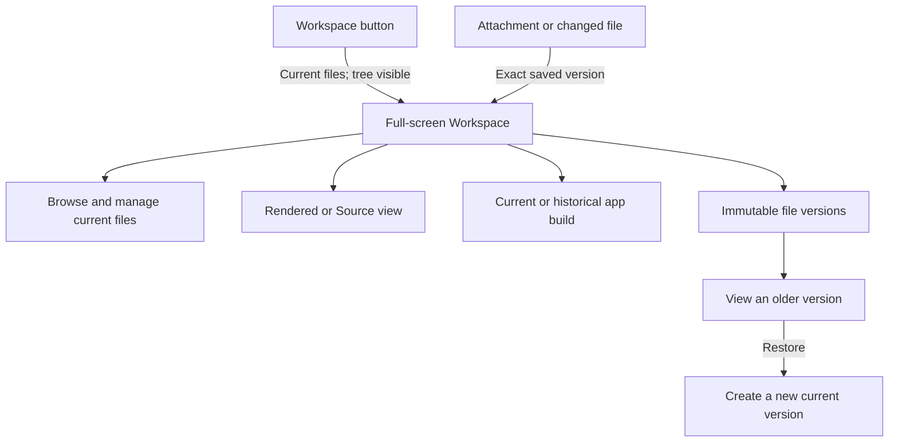

# Workspace and file previews

Each room has one Workspace shared by its conversation and agents. Work agents
use this live folder one at a time; Plan agents can inspect it concurrently.
Agenvyl records the folder in Git and keeps immutable versions for attachments,
response files, history, and restore.

The Workspace also has an **App** view for static builds captured from agent
runs. See [App builds and previews](app-builds.md).

## At a glance

```mermaid
flowchart TD
  Button[Workspace button] -->|Current files; tree visible| Window[Full-screen Workspace]
  Artifact[Attachment or changed file] -->|Exact saved version| Window
  Window --> Tree[Browse and manage current files]
  Window --> Preview[Rendered or Source view]
  Window --> App[Current or historical app build]
  Window --> History[Immutable file versions]
  History --> Older[View an older version]
  Older -->|Restore| Current[Create a new current version]
```

## Open the Workspace

- Select **+** beside the message composer, then **Open workspace**, to open the
  current files with the tree visible.
- Select an attachment or a changed file below an agent response to open the
  exact saved version associated with that message. The file tree remains
  available and can be shown when you need the rest of the room files.

Use the panel button to show or hide the tree. On desktop, drag its right edge
to resize it. Agenvyl remembers the width in that browser.

## Use the header

The header contains the controls available for the current file:

- **Workspace / filename** identifies the open file.
- The eye and code icons switch between **Rendered** and **Source** when both
  are available.
- The arrows move through older and newer versions. Select the `N / M` counter
  to open the complete history.
- The actions menu can contain Attach, Download, Restore, Rename, Move, Delete,
  and Refresh.
- **App** and **Files** switch between a captured app build and the editable
  file tree.

Hover over an icon to see its label.

## Browse and manage files

The file tree supports search, upload, drag-and-drop upload, folders, rename,
move, delete, Trash, restore, and opening the current version. Double-click a
normal file in the tree to rename it.

The upload picker accepts up to 10 files in one action. If a path already
exists, Agenvyl asks whether to replace it or choose another name. The default
file-size limit is 50 MiB. Larger files written by an agent or external program
can appear as `oversize`, but cannot be versioned or attached.

Workspace actions are temporarily blocked while any agent run is active in the
room, including Plan. Wait for the runs to finish or stop before uploading,
moving, restoring, or deleting files.

## Preview and inspect files

| File type | Available view |
| --- | --- |
| HTML, Markdown, SVG | Rendered and Source |
| Source code, JSON, configuration, logs, and text | Source |
| Images and PDF | Rendered |
| Unsupported binary content | File information and Download |

Rendered HTML opens in an isolated preview context. Source displays saved
bytes as text and does not execute HTML or SVG. See
[Trust and security](trust-and-security.md#file-preview-boundary) before
opening unfamiliar generated content.

### Image and SVG controls

Use the preview controls to fit or zoom images. For SVG, place the pointer over
the rendered image and use the mouse wheel to zoom around that point. Drag the
zoomed preview to inspect another area. Reset or fit the preview to return to
the complete image.

SVG content is constrained to the preview area so an oversized intrinsic canvas
does not expand the Workspace layout.

### Source controls

Source view detects UTF-8 and common encodings automatically. If text looks
incorrect, use **Encoding** to choose UTF-8, UTF-16 LE/BE, Windows-1251,
Windows-1252, or KOI8-R. This changes display only.

The source toolbar can wrap long lines and copy text. On desktop, the read-only
code viewer also provides line numbers, search, folding, and highlighting.

- Up to 1 MiB: full syntax highlighting.
- Above 1 MiB and up to 5 MiB: plain text.
- Above 5 MiB: download only.

These display limits do not change the Workspace file-size limit.

## Work with file versions

The version list identifies:

- **Current** — the bytes currently present at the Workspace path; and
- **Viewing** — an older immutable version opened without changing the file.

Select **Restore this version** to write the older content as a new current
version. Restore keeps the intervening history. Renaming or moving a tracked
file also keeps its saved history.

The viewer follows changes while you are viewing Current. A deliberately opened
historical version remains pinned until you return to Current.

## Attach and download a version

**Attach** adds the version currently being viewed to the composer. It remains
tied to those exact bytes even if the current file changes. **Download** also
uses the selected version.

Images opened from one message or response can be browsed as a gallery. Gallery
navigation moves between images; version navigation moves through one file's
history.

## Understand agent file changes

Work runs use a FIFO queue and share the same live folder. A later Work run sees
files left by the previous run after finalization. Plan runs can execute in
parallel against that folder. There is no separate publication or
conflict-resolution step.

Parallel Plan relies on the harness remaining read-only. Native Plan provides
the strongest protection available from that harness; instruction-only Plan
cannot prevent concurrent writes. Use Work when agents may change files.

When a run ends, Agenvyl records a Git checkpoint, compares it with the
checkpoint from before the run, and saves exact versions of changed project
files. The timeline shows:

- **Finalizing files…** while this recording is in progress; and
- **Workspace updated · N files** when project files were recorded.

Select a file below the response to open its exact captured version. Generated,
dependency, cache, test, and secret-like paths are omitted from the response's
normal changed-file list. A static build can still retain its generated output
as a separate preview bundle.

Failed and cancelled runs can leave file changes. Stopping a run does not roll
back commands that already completed.

### Git-backed behavior

The room folder is a visible Git repository. Agenvyl creates checkpoints before
and after runs and after Workspace actions. External edits are included in the
next checkpoint.

Do not leave the repository in the middle of merge, rebase, cherry-pick,
revert, or bisect. Agenvyl blocks a run when it detects an unfinished Git
operation so it does not record an ambiguous checkpoint. Complete or abort the
Git operation in the room folder, then retry the run.

`.git`, `.versions`, and `.agenvyl` are reserved paths in the Workspace UI.
Do not remove or edit application-managed version content by hand.

## Use `plan.md`

`plan.md` is an ordinary versioned Markdown file. Turning on Plan does not
create or update it automatically.

## Close and return

Use the close button, press `Escape`, or use the browser Back action. Moving
between files, versions, and preview modes updates the Workspace location
without adding a Back step for every selection. A direct link can reopen the
same file, version, view mode, and tree state.
